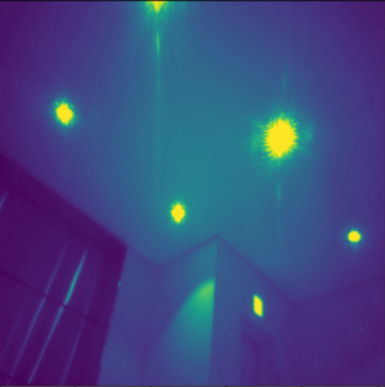
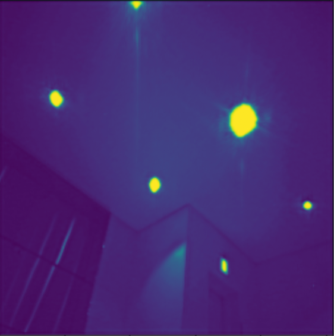

# Camera Light Streaks Detection and Noise Filtering

This study is motivated by the application of data mining techniques to address issues caused by light streaks in images due to camera hardware anomalies. While modern camera lenses can capture vivid images in low-light environments, adjustments such as ISO, aperture, or shutter speed are often required. Nowadays, data mining and machine learning methods are applied in software to complement hardware limitations. This paper introduces methods of image preprocessing and light detection.

As part of the process to eliminate light noise, two major aspects are focused on:

1. Dimensionality reduction to handle high-resolution photos.
2. Image segmentation to distinguish light from the background elements (e.g., buildings, ceiling, streets).

## Data Description
The dataset contains indoor and outdoor glares of lighting pictures that are taken by an LG night mode camera. The dataset contains three files: train input dataset, train label dataset, and test input dataset. Both the training input and label dataset contain 622 images, while the test input dataset contains 20 images. The difference between the training input and train label dataset is train input dataset consists of images with the noises (light strikes). However, the training label dataset is trained images from the train input dataset. Note that all size of images is 2448 (height) and 3264 (width) pixels. 

## Methods
The training and validation dataset is split into an 85:15 ratio from the train images. To be more specific, the models suggested in this paper are fitted on the 476 training set, and the fitted model is validated with 84 validation images; then, 20 test images are used for the prediction. Principal Component Analysis (PCA) was used to compress images and handle the large dataset. Additionally, the K-means clustering method and Gaussian Mixture Model (GMM) were employed for image segmentation, and a comparison was made between these two methods.

For the noise filtering model, autoencoders and variational autoencoders (VAEs) were implemented. To enhance the model's performance, Gaussian noise was introduced to the images. The model was then trained using both the original images and the images with added Gaussian noise. Notably, VAE and DAE were not effectively denoised the light strikes; however, autoencoder consists of three convolutional layers with max-pooling layers turned out to be the optimal modeling and it returns smoother output images. 

## Result
| Test Image             | Autoencoder Image      |
| ---------------------- | ---------------------- |
|  |  |

The test image on the right-hand side features light strikes and noises, and the autoencoder demonstrates its effectiveness in deblurring the noise in the image
